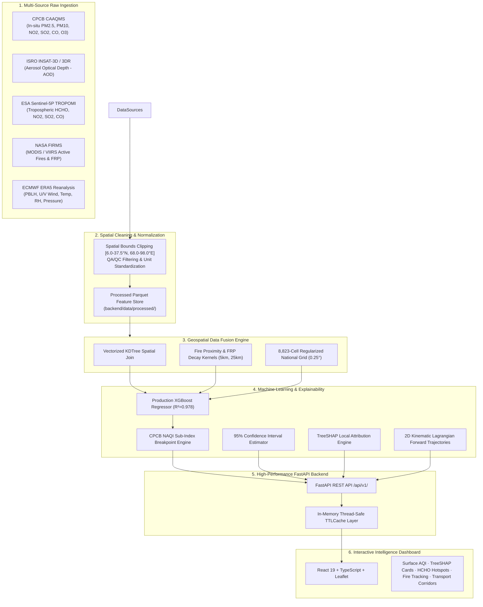

# AIMLess — India Air Quality & Pollution Intelligence Platform

[](https://sih.gov.in)
[](https://fastapi.tiangolo.com)
[](https://react.dev)
[](https://www.typescriptlang.org)
[](https://xgboost.readthedocs.io)
[](LICENSE)

An AI-powered geospatial platform for monitoring, estimating, and explaining surface-level air quality across India, specifically addressing regions lacking continuous ground monitoring stations (CPCB CAAQMS) by fusing multi-satellite remote sensing, atmospheric reanalysis, and explainable machine learning.

---

## 📌 Problem Overview

Ground-level continuous ambient air quality monitoring stations (CAAQMS) deployed by the Central Pollution Control Board (CPCB) provide high-accuracy ground-truth measurements. However, they are predominantly concentrated in major tier-1 metropolitan cities. Over **85% of India's landmass**—including rural clusters, agricultural belts, and tier-2/3 towns—lacks continuous ground monitoring stations.

### The AIMLess Solution
AIMLess bridges this monitoring gap through:
1. **Multi-Source Geospatial Data Fusion**: Merging geostationary satellite AOD (ISRO INSAT-3D/3DR), polar-orbiting satellite trace gases (ESA Sentinel-5P TROPOMI), active fire thermal anomalies (NASA FIRMS MODIS/VIIRS), and synoptic meteorology (ECMWF ERA5).
2. **AI Surface PM2.5 Inference**: High-accuracy XGBoost regressor ($R^2 = 0.978$, $\text{MAE} = 5.75\,\mu\text{g/m}^3$) mapping atmospheric column measurements to ground-level PM2.5 and standard Indian National Air Quality Index (NAQI).
3. **Local Explainability (TreeSHAP)**: Answering *"Why is air quality estimated to be Poor?"* by breaking down the exact contribution ($\mu\text{g/m}^3$ and $\%$) of INSAT AOD, planetary boundary layer trapping, fire proximity, and wind dispersion.
4. **HCHO & Biomass Burning Intelligence**: Highlighting formaldehyde anomalies ($>2.0\sigma$) cross-correlated with active fires as potential precursor emission zones.
5. **Pollution Transport Pathways**: 2D kinematic Lagrangian forward trajectories tracing transboundary plume movement across regional corridors (e.g., Punjab $\to$ Delhi NCR).

---

## 🏛️ System Architecture



---

## 📊 Scientific Data Sources Catalog

| Source | Provider | Parameters / Observables | Spatial Resolution | Temporal Frequency | Role in Platform |
|---|---|---|---|---|---|
| **CAAQMS** | CPCB / MoEFCC | $\text{PM}_{2.5}, \text{PM}_{10}, \text{NO}_2, \text{SO}_2, \text{CO}, \text{O}_3$ | Point (In-Situ) | 15-minute / 1-hour | Ground truth for training & validation |
| **INSAT-3D / 3DR** | ISRO MOSDAC | Aerosol Optical Depth (AOD at 550nm) | $4\,\text{km} \times 4\,\text{km}$ | 30-minute / Hourly | Columnar aerosol loading over Indian subcontinent |
| **TROPOMI** | ESA Copernicus Sentinel-5P | $\text{HCHO}, \text{NO}_2, \text{SO}_2, \text{CO}$ tropospheric columns | $3.5\,\text{km} \times 5.5\,\text{km}$ | Daily (13:30 local) | Trace gas precursor hotspots & industrial emission proxies |
| **FIRMS** | NASA LANCE | Active fire coordinates, FRP (MW), Brightness (K) | $375\,\text{m}$ (VIIRS) / $1\,\text{km}$ (MODIS) | Near Real-Time (NRT) | Crop residue burning & wildfire proximity kernels |
| **ERA5** | ECMWF | Planetary Boundary Layer Height, 10m Wind U/V, 2m Temp, RH | $0.25^\circ \times 0.25^\circ$ (~$28\,\text{km}$) | Hourly | Dispersion, vertical trapping, and synoptic transport |

---

## 🧠 AI Model Evaluation & Benchmarks

The surface $\text{PM}_{2.5}$ model is validated using rigorous **5-Fold Cross-Validation** evaluated against co-located CPCB ground monitors across distinct climatological regions:

| Model Architecture | 5-Fold CV MAE ($\mu\text{g/m}^3$) | 5-Fold CV RMSE ($\mu\text{g/m}^3$) | 5-Fold CV $R^2$ | Status |
|---|---|---|---|---|
| **Ridge Regression (Baseline)** | 7.94 | 10.25 | 0.955 | Baseline Reference |
| **Random Forest Regressor** | 6.71 | 8.46 | 0.969 | Benchmark |
| **XGBoost Regressor (Production)** | **5.75** | **7.19** | **0.978** | **Deployed Production Artifact** |

### NAQI Category-Specific Error Breakdown
- **Satisfactory (AQI 51–100)**: $\text{MAE} = 0.72\,\mu\text{g/m}^3$ ($n = 66$)
- **Moderate (AQI 101–200)**: $\text{MAE} = 0.78\,\mu\text{g/m}^3$ ($n = 66$)
- **Poor (AQI 201–300)**: $\text{MAE} = 0.69\,\mu\text{g/m}^3$ ($n = 66$)
- **Very Poor (AQI 301–400)**: $\text{MAE} = 0.63\,\mu\text{g/m}^3$ ($n = 221$)

---

## 🔍 Scientific Classification Standard

To adhere to rigorous environmental science standards, all platform outputs strictly demarcate data origin:

- 🟢 **`Observed`**: In-situ continuous ambient air quality stations (CPCB CAAQMS).
- 🟣 **`Satellite Observed`**: Direct satellite column observations (Sentinel-5P HCHO, INSAT AOD, NASA FIRMS active fires).
- 🔵 **`AI Estimated`**: Machine-learning reconstructed surface concentrations (XGBoost Surface $\text{PM}_{2.5}$ + NAQI) with 95% Confidence Intervals.
- 🟡 **`Derived Analysis`**: Geospatial kinematic Lagrangian transport trajectories and plume dispersion assessments.

---

## 🚀 Quickstart Guide

### Prerequisites
- **Python**: 3.10+
- **Node.js**: 18+ (npm 9+)

### 1. Backend Setup & Startup
```powershell
# Navigate to repository root
cd c:\Projects\SIH

# Install Python dependencies
pip install -r backend/requirements.txt

# Run the master data ingestion pipeline (Optional: regenerates feature datasets)
python -m backend.app.data.processors.pipeline

# Train / evaluate ML models (Optional: regenerates model artifacts)
python -m backend.app.ml.training.trainer

# Start FastAPI production dev server
python -m uvicorn backend.app.main:app --host 0.0.0.0 --port 8000 --reload
```
API Documentation & Interactive Swagger UI will be available at: **`http://localhost:8000/docs`**.

### 2. Frontend Setup & Startup
```powershell
# Navigate to repository root
cd c:\Projects\SIH

# Install Node dependencies
npm install

# Start Vite dev server
npm run dev
```
Access the Dashboard at: **`http://localhost:5173`**.

---

## 🧪 Running Automated Test Suite

The repository includes a comprehensive 38-test unit and integration suite covering AQI math, data ingestors, geospatial fusion, ML inference, caching, and API endpoints:

```powershell
python -m pytest backend/tests/ -v
```

To run the frontend type-check and production bundle build:
```powershell
npm run build
```

---

## 📡 API Endpoint Overview

| Method | Endpoint | Description |
|---|---|---|
| `GET` | `/api/v1/health` | System health, demo dataset status, and catalog freshness |
| `GET` | `/api/v1/air-quality/stations` | Ground truth CPCB monitoring station records |
| `GET` | `/api/v1/air-quality/prediction?lat={lat}&lon={lon}` | Real-time AI PM2.5 prediction, 95% CI & TreeSHAP breakdown |
| `GET` | `/api/v1/air-quality/grid?min_lat={}&min_lon={}&max_lat={}&max_lon={}` | Sub-second spatial bounding box raster slice |
| `GET` | `/api/v1/air-quality/metrics` | Production model evaluation benchmarks & CV scores |
| `GET` | `/api/v1/hcho/hotspots` | Sentinel-5P TROPOMI HCHO anomalies & fire cross-correlation |
| `GET` | `/api/v1/fires/recent` | NASA FIRMS active fire points & state-wise FRP sums |
| `GET` | `/api/v1/transport/wind` | ERA5 synoptic wind vectors & 2D kinematic Lagrangian corridors |
| `GET` | `/api/v1/datasets` | Multi-source data catalog and ingestion status |

---

## 👥 Contributors & Acknowledgements
- **Team AIMLess** — Smart India Hackathon
- **Data Providers**: Central Pollution Control Board (CPCB), ISRO MOSDAC, ESA Copernicus Open Access Hub, NASA LANCE FIRMS, ECMWF Copernicus Climate Change Service.
