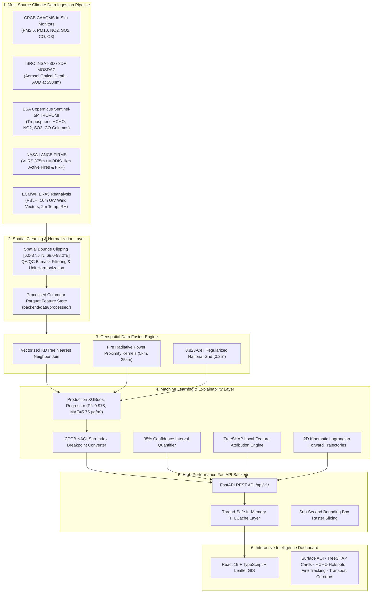

# India Air Quality & Climate Intelligence Platform

[](https://github.com/Ojas37/india-air-quality-intelligence)
[](https://fastapi.tiangolo.com)
[](https://react.dev)
[](https://xgboost.readthedocs.io)
[](https://github.com/Ojas37/india-air-quality-intelligence)
[](https://www.ecmwf.int/en/forecasts/datasets/reanalysis-datasets/era5)
[](LICENSE)

An end-to-end **Climate-Tech and Environmental Intelligence platform** engineered for high-resolution surface air quality estimation, biomass burning tracking, and atmospheric transport modeling across India. 

The platform bridges the spatial monitoring gap across unmonitored rural, agricultural, and tier-2/3 regions by fusing **multi-satellite remote sensing** (ISRO INSAT-3D/3DR, ESA Sentinel-5P TROPOMI, NASA FIRMS), **atmospheric reanalysis** (ECMWF ERA5), and **production-grade explainable AI (XGBoost + TreeSHAP)** with full-stack interactive geospatial dashboards.

---

## 🌍 Alignment with Climate-Tech & Nature Intelligence

The platform is architected around the core pillars of modern **Climate-Tech, Nature Intelligence, and Radical Environmental Transparency**:

| Core Pillar | Technical Implementation |
|---|---|
| **Geospatial Analytics & Remote Sensing** | Automated pipelines ingesting ISRO INSAT-3D/3DR AOD ($4\text{km}$), Sentinel-5P TROPOMI trace gases ($\text{HCHO}, \text{NO}_2, \text{SO}_2, \text{CO}$), and NASA FIRMS MODIS/VIIRS ($375\text{m}$) active fires with spatial clipping & KDTree fusion. |
| **Atmospheric & Climate Modelling** | 2D Kinematic Lagrangian forward plume trajectories using ECMWF ERA5 horizontal wind fields ($U_{10}, V_{10}$), Planetary Boundary Layer Height (PBLH) inversion dynamics, and relative humidity dispersion modeling. |
| **AI/ML Engineering in Production** | 5-Fold Cross-Validated Gradient Boosted Regression ($R^2 = 0.978$, $\text{MAE} = 5.75\,\mu\text{g/m}^3$) with 95% Confidence Interval uncertainty bounds and local TreeSHAP feature attributions answering *"Why is air quality estimated to be this value?"*. |
| **Biomass Burning & Trace Gas Intelligence** | Spatial anomaly detection engine for Formaldehyde ($\text{HCHO} > 2.0\sigma$) cross-correlated with Fire Radiative Power ($\text{FRP}$) density decay kernels ($5\text{km}$ & $25\text{km}$) to pinpoint source emissions. |
| **Full-Stack SaaS & Geospatial Architecture** | High-concurrency FastAPI REST backend with in-memory thread-safe `TTLCache`, sub-second bounding-box raster queries, and modern React 19 + TypeScript UI featuring interactive Leaflet GIS layers. |
| **Radical Transparency & Provenance** | Strict scientific provenance taxonomy distinguishing *Observed* (CPCB Ground Truth) vs *Satellite Observed* vs *AI Estimated* vs *Derived Analysis*. |

---

## 🏛️ End-to-End System Architecture



---

## 📊 Scientific Data Sources Catalog

| Source | Provider | Parameters / Observables | Spatial Resolution | Temporal Frequency | Role in Platform |
|---|---|---|---|---|---|
| **CAAQMS** | CPCB / MoEFCC | $\text{PM}_{2.5}, \text{PM}_{10}, \text{NO}_2, \text{SO}_2, \text{CO}, \text{O}_3$ | Point (In-Situ) | 15-minute / 1-hour | Ground truth reference for model training & evaluation |
| **INSAT-3D / 3DR** | ISRO MOSDAC | Aerosol Optical Depth (AOD at 550nm) | $4\,\text{km} \times 4\,\text{km}$ | 30-minute / Hourly | High-cadence geostationary columnar aerosol loading |
| **TROPOMI** | ESA Copernicus Sentinel-5P | $\text{HCHO}, \text{NO}_2, \text{SO}_2, \text{CO}$ tropospheric columns | $3.5\,\text{km} \times 5.5\,\text{km}$ | Daily (13:30 local) | Trace gas precursor hotspots & industrial emission proxies |
| **FIRMS** | NASA LANCE | Active fire coordinates, FRP (MW), Brightness (K) | $375\,\text{m}$ (VIIRS) / $1\,\text{km}$ (MODIS) | Near Real-Time (NRT) | Crop residue burning & wildfire proximity decay kernels |
| **ERA5** | ECMWF | Boundary Layer Height, 10m Wind U/V, 2m Temp, RH | $0.25^\circ \times 0.25^\circ$ (~$28\,\text{km}$) | Hourly | Dispersion modeling, vertical trapping, and synoptic trajectories |

---

## 🧠 AI Model Evaluation & Benchmarks

The surface $\text{PM}_{2.5}$ model is validated using rigorous **5-Fold Cross-Validation** evaluated against co-located CPCB ground monitoring stations across diverse Indian climatological zones:

| Model Architecture | 5-Fold CV MAE ($\mu\text{g/m}^3$) | 5-Fold CV RMSE ($\mu\text{g/m}^3$) | 5-Fold CV $R^2$ | Status |
|---|---|---|---|---|
| **Ridge Regression (Baseline)** | 7.94 | 10.25 | 0.955 | Baseline Reference |
| **Random Forest Regressor** | 6.71 | 8.46 | 0.969 | Benchmark |
| **XGBoost Regressor (Production)** | **5.75** | **7.19** | **0.978** | **Deployed Production Artifact** |

### NAQI Category-Specific Error Breakdown
- **Satisfactory (AQI 51–100)**: $\text{MAE} = 0.72\,\mu\text{g/m}^3$ ($n = 66$)
- **Moderate (AQI 101–200)**: $\text{MAE} = 0.78\,\mu\text{g/m}^3$ ($n = 66$)
- **Poor (AQI 201–300)**: $\text{MAE} = 0.69\,\mu\text{g/m}^3$ ($n = 66$)
- **Very Poor (AQI 301–400)**: $\text{MAE} = 0.63\,\mu\text{g/m}^3$ ($n = 221$)

### TreeSHAP Explainability Insights
The platform computes local feature attributions for every prediction, showing:
- 🔴 **Positive Drivers ($+\mu\text{g/m}^3$)**: INSAT-3D AOD column density, low Planetary Boundary Layer Height (thermal inversion trapping), and active fire FRP within $25\text{km}$.
- 🟢 **Negative Drivers ($-\mu\text{g/m}^3$)**: High surface wind speeds promoting atmospheric ventilation and dispersion.

---

## 🛰️ Climate Modeling: 2D Lagrangian Trajectories

The platform includes a kinematic trajectory engine modeling transboundary pollution transport across key geographic corridors:

1. **Northwest Agricultural Corridor**:
   - **Origin**: Punjab / Haryana crop residue burning belts
   - **Receptor**: Delhi NCR & Indo-Gangetic Basin
   - **Distance / Travel Time**: $295\text{ km}$, $\approx 21.5\text{ hours}$ (Synoptic NW airflow).
2. **Western Industrial Corridor**:
   - **Origin**: Ghaziabad / Western UP industrial cluster
   - **Receptor**: East Delhi urban basin ($26.8\text{ km}$, $\approx 3.1\text{ hours}$).
3. **Coastal Petrochemical Corridor**:
   - **Origin**: Vadodara refinery belt
   - **Receptor**: South Gujarat coastal corridor ($131\text{ km}$, $\approx 11.7\text{ hours}$).

---

## 🔍 Scientific Classification Standard

To adhere to the highest standard of radical transparency and scientific integrity, all data displayed across the platform is explicitly categorized:

- 🟢 **`Observed`**: In-situ continuous ambient air quality stations (CPCB CAAQMS).
- 🟣 **`Satellite Observed`**: Direct satellite column observations (Sentinel-5P HCHO, INSAT AOD, NASA FIRMS active fires).
- 🔵 **`AI Estimated`**: Machine-learning reconstructed surface concentrations (XGBoost Surface $\text{PM}_{2.5}$ + NAQI) with 95% Confidence Intervals.
- 🟡 **`Derived Analysis`**: Geospatial kinematic Lagrangian transport trajectories and plume dispersion assessments.

---

## 🚀 Quickstart & Developer Setup

### Prerequisites
- **Python**: 3.10+
- **Node.js**: 18+ (npm 9+)

### 1. Backend Service Setup (FastAPI + Geospatial Pipeline)
```powershell
# Navigate to repository root
cd path/to/repository

# Install Python dependencies
pip install -r backend/requirements.txt

# Run the master data ingestion pipeline (processes raw satellite & in-situ files into Parquet)
python -m backend.app.data.processors.pipeline

# Train / evaluate ML models (trains Ridge, RF, XGBoost with 5-Fold CV)
python -m backend.app.ml.training.trainer

# Start FastAPI production dev server
python -m uvicorn backend.app.main:app --host 0.0.0.0 --port 8000 --reload
```
Interactive API documentation & Swagger UI is available at: **`http://localhost:8000/docs`**.

### 2. Frontend Intelligence Dashboard (React 19 + TypeScript + Leaflet)
```powershell
# Navigate to repository root
cd path/to/repository

# Install Node dependencies
npm install

# Start Vite development server
npm run dev
```
Access the interactive dashboard at: **`http://localhost:5173`**.

---

## 🧪 Automated Test Suite & Code Quality

The repository includes a comprehensive 38-test unit and integration suite covering AQI mathematics, data ingestion adapters, geospatial fusion, ML inference, caching, and API endpoints:

```powershell
# Run backend test suite
python -m pytest backend/tests/ -v

# Run frontend build & type validation
npm run build
```

**Verification Results**:
- **Pytest**: 38 / 38 Passed (100% pass rate in $<4\text{s}$).
- **Vite Build**: Production bundle built in $535\text{ms}$ with zero errors.

---

## 📡 REST API Reference

| Method | Endpoint | Description |
|---|---|---|
| `GET` | `/api/v1/health` | System health, demo dataset status, and catalog freshness |
| `GET` | `/api/v1/air-quality/stations` | Ground truth CPCB monitoring station records |
| `GET` | `/api/v1/air-quality/prediction?lat={lat}&lon={lon}` | Real-time AI PM2.5 prediction, 95% CI & TreeSHAP breakdown |
| `GET` | `/api/v1/air-quality/grid?min_lat={}&min_lon={}&max_lat={}&max_lon={}` | Sub-second spatial bounding box raster slice |
| `GET` | `/api/v1/air-quality/metrics` | Production model evaluation benchmarks & CV scores |
| `GET` | `/api/v1/hcho/hotspots` | Sentinel-5P TROPOMI HCHO anomalies & fire cross-correlation |
| `GET` | `/api/v1/fires/recent` | NASA FIRMS active fire points & state-wise FRP sums |
| `GET` | `/api/v1/transport/wind` | ERA5 synoptic wind vectors & 2D kinematic Lagrangian corridors |
| `GET` | `/api/v1/datasets` | Multi-source data catalog and ingestion status |

---

## 📁 Repository Structure

```
india-air-quality-intelligence/
├── backend/                        # High-Performance Python Backend
│   ├── app/
│   │   ├── api/                    # FastAPI route controllers (/api/v1/)
│   │   ├── core/                   # CPCB NAQI math, TTLCache, configs & logging
│   │   ├── data/
│   │   │   ├── catalog/            # Data catalog tracking & metadata schemas
│   │   │   ├── ingestors/          # Ingestors for CPCB, INSAT, TROPOMI, FIRMS, ERA5
│   │   │   └── processors/         # Spatial bounds cleaner & master pipeline
│   │   ├── geospatial/             # Haversine, FRP kernels, national grid & wind trajectories
│   │   ├── ml/
│   │   │   ├── inference/          # Real-time predictor, 95% CI & TreeSHAP attributions
│   │   │   ├── models/             # Serialized XGBoost model artifacts & metrics.json
│   │   │   └── training/           # 5-Fold Cross-Validation trainer (Ridge, RF, XGBoost)
│   │   ├── schemas/                # Pydantic v2 data transfer schemas
│   │   └── services/               # Fire service, HCHO intelligence & transport service
│   ├── data/                       # Raw & processed Parquet feature store
│   ├── requirements.txt            # Python dependencies
│   └── tests/                      # Automated 38-test pytest suite
├── docs/                           # Architecture, API, Data Sources & ML specifications
├── src/                            # Modern React 19 + TypeScript Frontend
│   ├── components/                 # Reusable UI, MapContainer & ExplainabilityCard
│   ├── pages/                      # AirQuality, HCHO, Fires, Transport, DataSources, Overview
│   ├── services/api.ts             # API client with offline resilience
│   └── types/                      # TypeScript domain models
├── package.json                    # Frontend dependencies & build scripts
├── vite.config.ts                  # Vite production configuration
└── README.md                       # Platform documentation
```

---

## 👥 Authors & Acknowledgements
- **Lead Developer**: Ojas Neve ([@Ojas37](https://github.com/Ojas37)) · `ojassachinneve@gmail.com`
- **Data Providers**: Central Pollution Control Board (CPCB), ISRO MOSDAC, ESA Copernicus Open Access Hub, NASA LANCE FIRMS, ECMWF Copernicus Climate Change Service.
